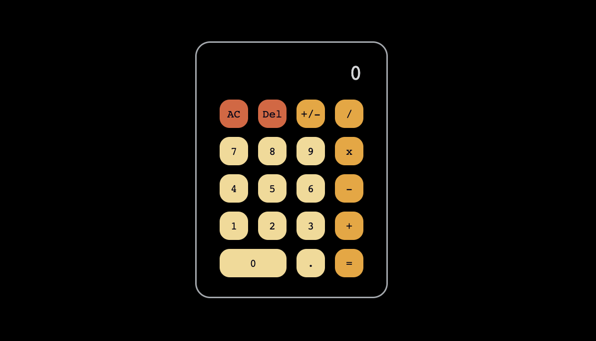

# Calculator

[LIVE](https://mrzadzinski.github.io/calculator/)

Calculator app.

## Features
* The same behavior as in regular calculator (except few simplifications)
* Input by mouse or keys
* Limited input length to prevent display overflow
* Exponential notation for large numbers
* Very low values (10^(-7)) reduced to zero 
* Backspace

## Technologies
* Javascript
* HTML
* CSS (Flexbox)

## Skills practiced
* Javascript syntax, methods and logic

## Acknowledgments
* This project was an assignment from The Odin Project course:
  * [Calculator](https://www.theodinproject.com/lessons/foundations-calculator)
